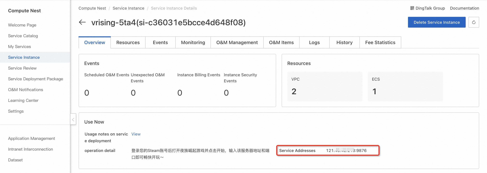
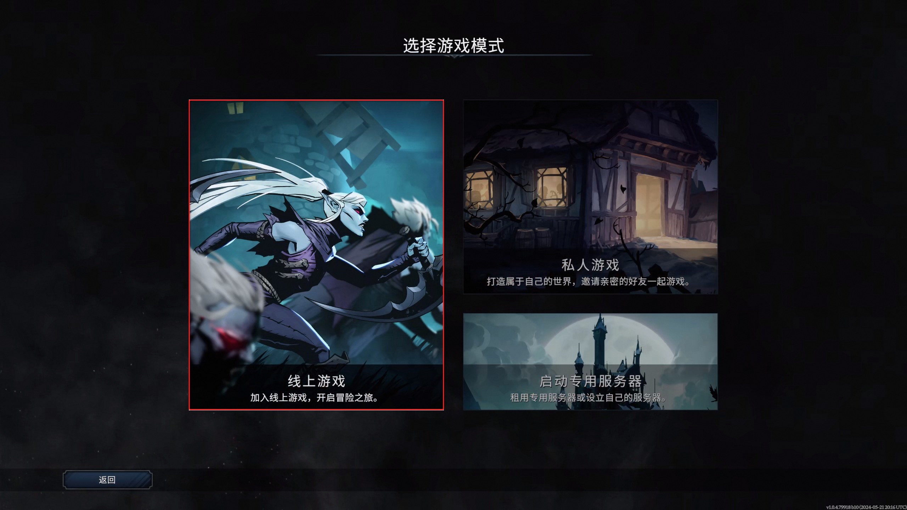
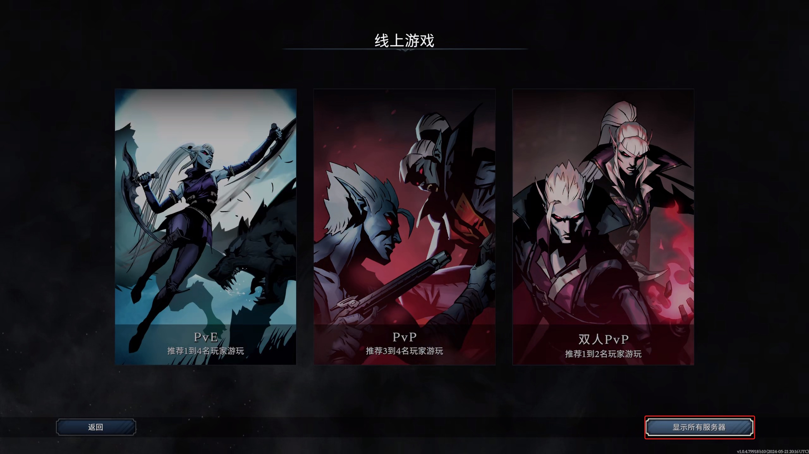

<h1>3-minute deployment of the Night Family Rise online service </h1>

<h2> Overview </h2>

 "Rise of the Night Clan" is a massively multiplayer online action-adventure game produced and released by Stunlock Studios. It is launched in a gothic-style open world. Players will play a weak vampire who has just woken up, looking for blood to recover. Strength, while avoiding the scorching sun to survive. Rebuild castles and vampire empires and turn humans into loyal servants. On May 8, 2024, the 1.0 full version of "Rise of the Night Clan" was officially launched on the Steam platform. 

<h2> Billing instructions </h2>

 the cost of the night family rise online service on the computing nest mainly involves: the selected vCPU and memory specifications, disk capacity, and public network bandwidth
Billing methods include: annual package, monthly package, pay-as-you-go (hours)
The estimated cost can be seen in real time when the instance is created. 

<h2> Create an ECS </h2>

<h3> Step 1: Select Configuration </h3>

<ol>
<li> Service instance name (if there is no special requirement, keep the default);</li>
<li> Select the deployment region (you can select the city closest to you. If there are no special requirements, keep the default value);</li>
<li>
 Select configuration:

<table>
<thead>
<tr>
<th> Package name </th>
<th> Description </th>
</tr>
</thead>
<tbody>
<tr>
<td> Play recommend 1 to 4 players </td>
<td>4-core 16G,10M bandwidth unlimited traffic </td>
</tr>
<tr>
<td> recommend 3 to 4 players to play </td>
<td>8-core 32G,10M bandwidth unlimited traffic </td>
</tr>
<tr>
<td> Custom Package </td>
<td> ECS configuration can be freely selected (at least 16G of memory for selected specifications), suitable for high-level DIY players </td>
</tr>
</tbody>
</table>

<li>
 Configure the server password and Availability Zone (if there are no special requirements, keep the default). 
</li>
<li> configure the game parameters. after the configuration is completed, click next to confirm the submission of the order.
</ol>

<h3> Step 2: Create a service </h3>

<ol>
<li> on the service confirmation page, check agree to the terms of service, click "create now", followed by the payment process. </li>
<li> when the prompt of successful submission appears, the service has been created. click "go to the list to view" to see that the service is being deployed.
</ol>

<h3> Step 3: Enter the instance details </h3>

<ol>
<li> the service can be created in less than 1 minute. when the service status changes to "deployed", click the service instance ID to enter the service details.
<li> by the time of this step, the server-side installation program for the rise of the night family has been preset in the image of the service, which is very convenient without manual copying. </li>
<li> see "ServerAddress", this is the IP address of the server you built, copy this address for the next operation.
</li>
</ol>

<h2> Login to the game </h2>

 Pre-condition: Night Family Rise has been purchased and installed on the steam platform. 

<ol>
<li>
 Log in to your Steam account and start the game.
<li>
 Enter the game and click to start the game.
<li>
 Select the online game.

</li>
<li>
 Displays all servers.

</li>
<li>
 Connect directly to the server.

</li>
<li>
 Paste the server address port generated above and connect.
<li>
 wait for the game to load and play.

</li>
</ol>
