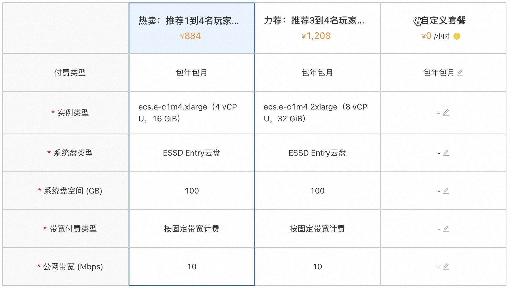
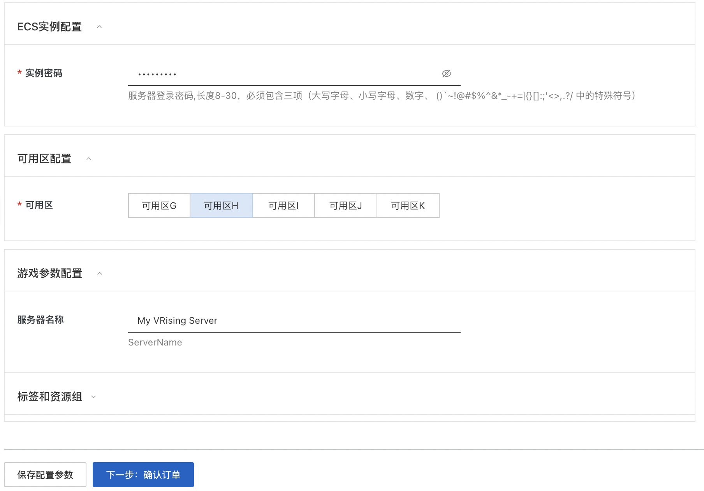
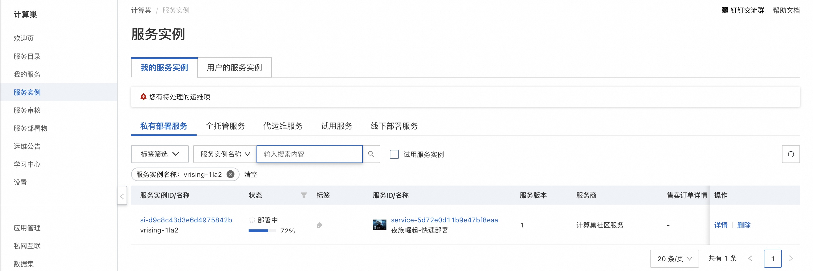
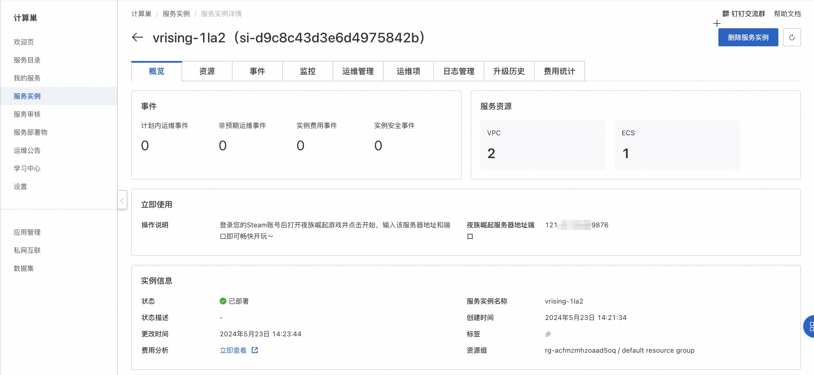
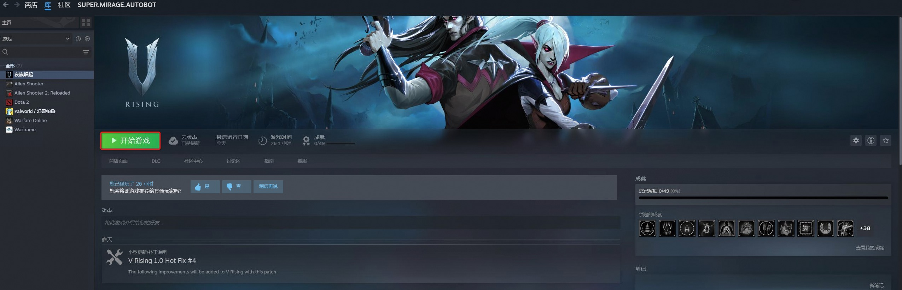
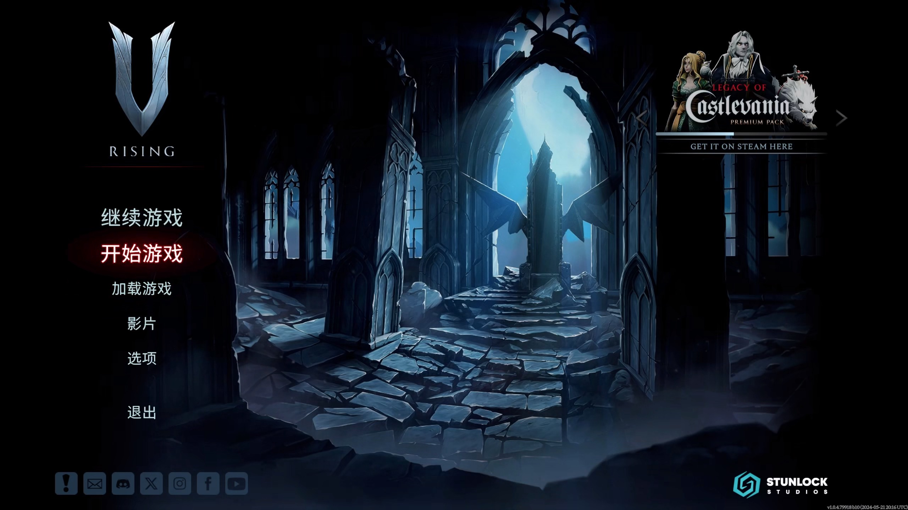
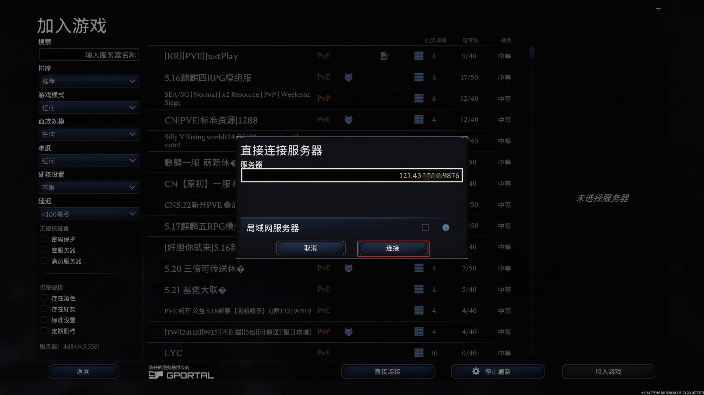

# 3分钟部署夜族崛起联机服务

## 概述

《夜族崛起》是Stunlock Studios制作发行的一款大型多人在线的动作冒险游戏，以哥特风格的开放世界展开，玩家将扮演一名刚醒来的虚弱吸血鬼，寻找血液以恢复体力，同时躲避烈日以求生存。重建城堡和吸血鬼帝国，将人类变成忠诚的仆人。2024年5月8日，《夜族崛起》1.0完整版正式上线Steam平台。

## 计费说明

夜族崛起联机服务在计算巢上的费用主要涉及：所选vCPU与内存规格、磁盘容量、公网带宽
计费方式包括：包年包月、按量付费（小时）
预估费用在创建实例时可实时看到。

## 创建云服务器

### 第一步：选择配置

1. 服务实例名称（如无特殊要求，保持默认即可）；
2. 选择部署地域（可以选择离自己最近的城市，如无特殊要求，保持默认即可）；
3. 选择配置:

   | 套餐名        | 说明                                 |
   |------------|------------------------------------|
   | 推荐1到4个玩家游玩 | 4核16G，10M带宽不限流量                    |
   | 推荐3到4个玩家游玩 | 8核32G，10M带宽不限流量                    |
   | 自定义套餐      | 可自由选择ECS配置（所选规格的内存至少16G），适合高阶DIY玩家 |
   

4. 配置服务器密码和 可用区（如无特殊要求，保持默认即可）。
5. 配置游戏参数，配置完成之后，点击下一步，确认提交订单。
   

### 第二步：创建服务

1. 在服务确认页面，勾选同意服务条款，点击“立即创建”，后面就是付款流程。
2. 当出现提交成功提示，说明服务已经开始创建，点击“去列表查看”，可以看到服务正在部署中。
   

### 第三步：进入实例详情

1. 服务不到1分钟即可完成创建，当服务的状态变成“已部署”，点击服务实例ID进入服务详情。
   
2. 到这一步的时候，夜族崛起的服务端安装程序已经预置在服务的镜像里了，无需手动复制，非常方便。
3. 看到“夜族崛起服务器地址端口”，这就是你搭建服务器的IP地址了，复制这个地址用于下一步操作。
   

## 登录游戏

前置条件：已经在steam平台购买并安装夜族崛起。

1. 登录您的steam账号并开始游戏。
   

2. 进入游戏后点击开始游戏。
   

3. 选择线上游戏。
   

4. 显示所有服务器。
   

5. 直接连接服务器。
   

6. 粘贴上文生成的服务器地址端口并连接。
   

7. 等待游戏加载完成即可畅玩啦。
   
